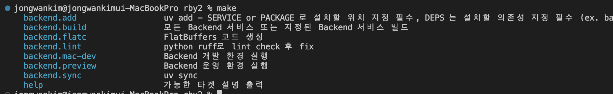

# backend 초기 설정하기

## 1. uv 설치

### 1-1. Windows (PowerShell):

```bash
irm https://astral.sh/uv/install.ps1 | iex
```

### 1-2. Linux/macOS:

```bash
curl -LsSf https://astral.sh/uv/install.sh | sh
export PATH="$HOME/.local/bin:$PATH"
```

## 2. make 설치

### 2-1. Windows (PowerShell):

```bash
choco install make
```

### 2-2. Linux (Ubuntu/Debian 계열):

```bash
sudo apt-get update
sudo apt-get install -y make
```

### 2-3. macOS:

> macOS는 기본적으로 `make`명령어가 존재함 없으면 진행 바람

```bash
brew install make
```

## 3. Docker 설치

## 3-1. Windows:

### [Docker Desktop 다운로드]

공식 페이지: https://www.docker.com/products/docker-desktop/

- Windows 10/11 Pro, Enterprise, Education(WSL2 지원)에서 사용 권장
- 설치 중 WSL 2 및 Hyper-V 옵션을 선택
- 설치 후 재부팅

### 3-2. Linux (Ubuntu/Debian):

#### [필수 패키지 설치]
```bash
sudo apt-get update
sudo apt-get install -y ca-certificates curl gnupg lsb-release
```

#### [Docker GPG 키 추가]
```bash
sudo mkdir -p /etc/apt/keyrings
curl -fsSL https://download.docker.com/linux/ubuntu/gpg | sudo gpg --dearmor -o /etc/apt/keyrings/docker.gpg
```

#### [Docker 저장소 등록]
```bash
echo \
  "deb [arch=$(dpkg --print-architecture) signed-by=/etc/apt/keyrings/docker.gpg] https://download.docker.com/linux/ubuntu \
  $(lsb_release -cs) stable" | sudo tee /etc/apt/sources.list.d/docker.list > /dev/null
```

#### [Docker Engine 설치]
```bash
sudo apt-get update
sudo apt-get install -y docker-ce docker-ce-cli containerd.io docker-buildx-plugin docker-compose-plugin
```

#### [권한 설정 (선택)]
```bash
sudo usermod -aG docker $USER
newgrp docker
```

#### [실행 확인]
```bash
docker --version
```

### 3-3. macOS:

#### [Docker Desktop 다운로드]

공식 페이지: https://www.docker.com/products/docker-desktop/

- Intel 칩/Apple Silicon(M1, M2, M3)용 따로 제공되므로 맞는 버전 선택
- 처음 실행 시 보안 권한 허용 필요


## 4. Backend 프로젝트 초기화

위 사항을 모두 다 했다면 아래의 명령어를 실행하여 backend 프로젝트를 최종적으로 세팅을 마무리 한다.

```bash
bash script/backend/init-project.sh
```

## 5. Backend 프로젝트 명령어 확인 방법

루트 경로나 `backend` 디렉토리에서 `make` 명령어를 치면 backend script들 확인 가능

```bash
make
#or make help
```

